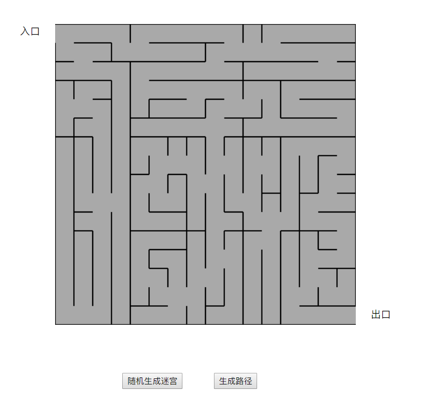
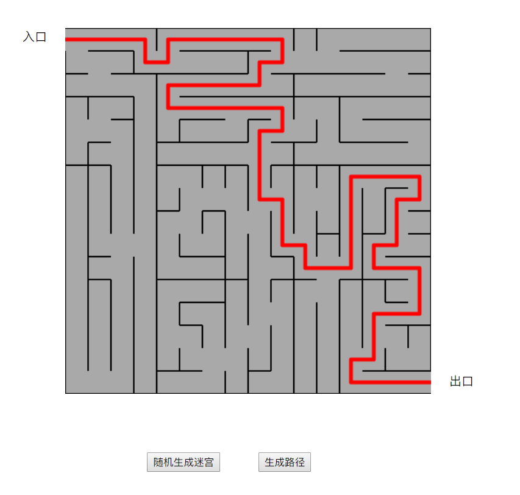
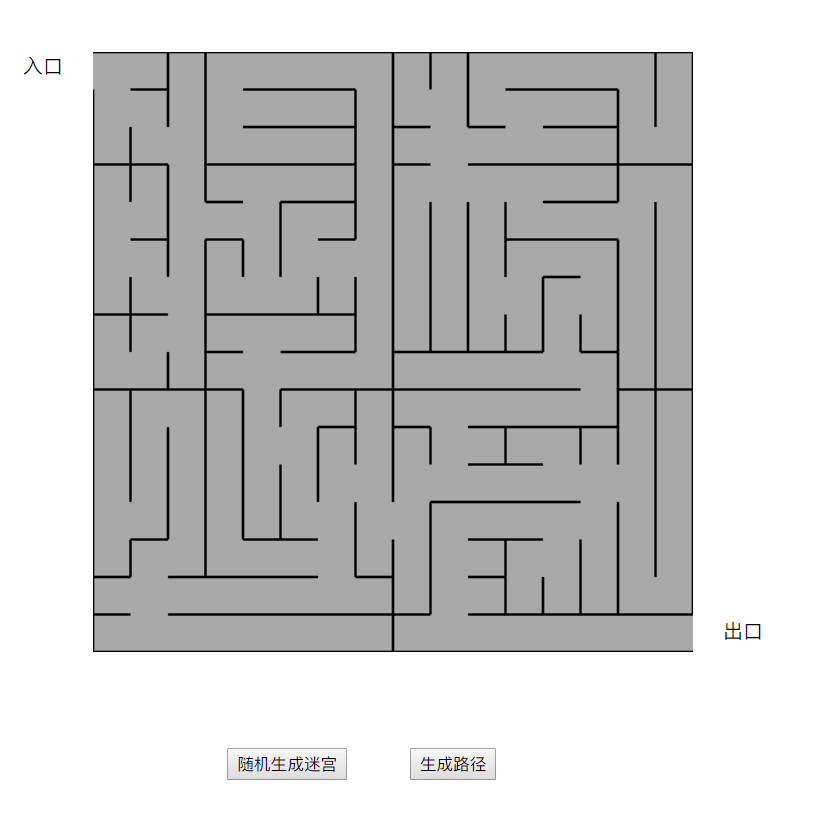

# maze
生成迷宫和走迷宫

### 作业任务
	迷宫：随机生成迷宫，并根据迷宫找出最短路径。
### 运行环境
	Windows10， idea， Chrome浏览器
### 算法介绍
	迷宫生成，我使用的是随机分割再加递归的方法。
 - 首先将整个大正方形用随机位置的两个横线和竖线，随机分割成四部分，同时在这相交的四条线中随机选出三条，在每条线上，再随机生成一个位置，将这个位置的线消去，这样就将四部分连接了起来。
 - 再将分割成的四个小矩形按照同样的方式进行分割，递归的方式对每个矩形进行操作，直到分割成的矩形不能再分割，即宽或者高为1时，不可再分割。
 - 这样整个大正方形中的每一部分都是连接在一起的，都是可以互相访问的。
迷宫路径生成，广度优先搜索法
 - 根据生成的迷宫，进行广度优先遍历，当有一个分支到达终点，即获取了最新路径，遍历结束。
 - 将遍历过的位置记录下来，以免重复遍历，剪枝，避免无用功。
### 程序分析
	程序使用html和JavaScript完成，JavaScript采用vue.js进行写，采用canvas画布进行生成迷宫和路径。	
### 界面截图
 - 初始界面
	
 - 点击生成路径的按钮后的界面
 	
 - 点击随机生成迷宫按钮后，会再生成一个迷宫
 	
 

